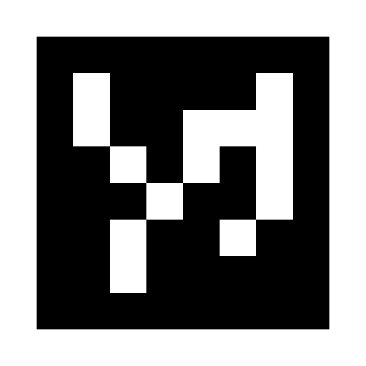

# Stereolabs ZED - ArUco sample

This sample shows how to reset the ZED camera tracking to a known reference using an ArUco marker.

## Mono

The Mono camera sample located in the [mono folder](./mono) provides an easy way to reset the positional tracking using a marker as a known fixed position in space.

## Multi Camera

The [multi camera sample](./multi-camera) use the marker location to calibrates multiples ZED camera in space. By pointing all the camera to a unique marker, the position of each can be deduced.
The point cloud of every camera is then displayed in the same referential.

## Other

Feel free to modify either sample to fit your need, the marker detection is very convenient and robust and can be used to a number of application where an external position has to be known.

## ArUco markers

This [website](http://chev.me/arucogen/) can be used to easily display Aruco patterns.

The sample is expecting a `6x6 Aruco` Dictionary with a 160mm marker by default. The bigger the marker, the better the camera position will be.
It's important to make sure that the real-world size of the marker matches the size set in the samples (160mm) to avoid scale issues in the tracking.

## ArUco detection

The Aruco detection code is taken from OpenCV Contrib module, please refer to the source files for the license information (BSD 3).

## Support
If you need assistance go to our Community site at https://community.stereolabs.com/
